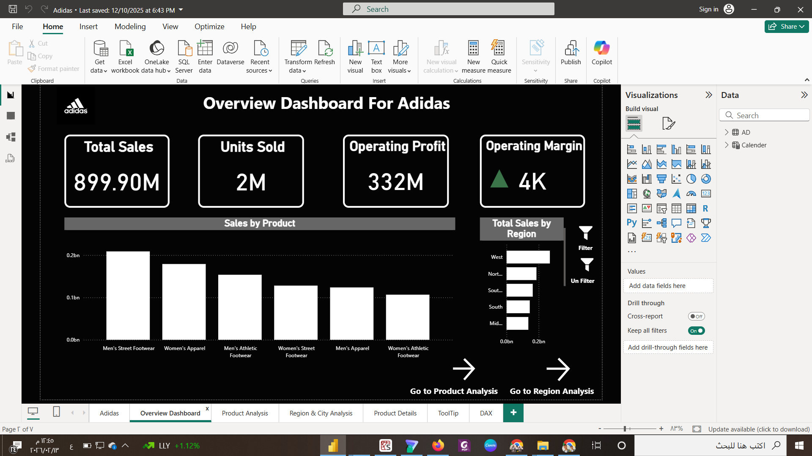
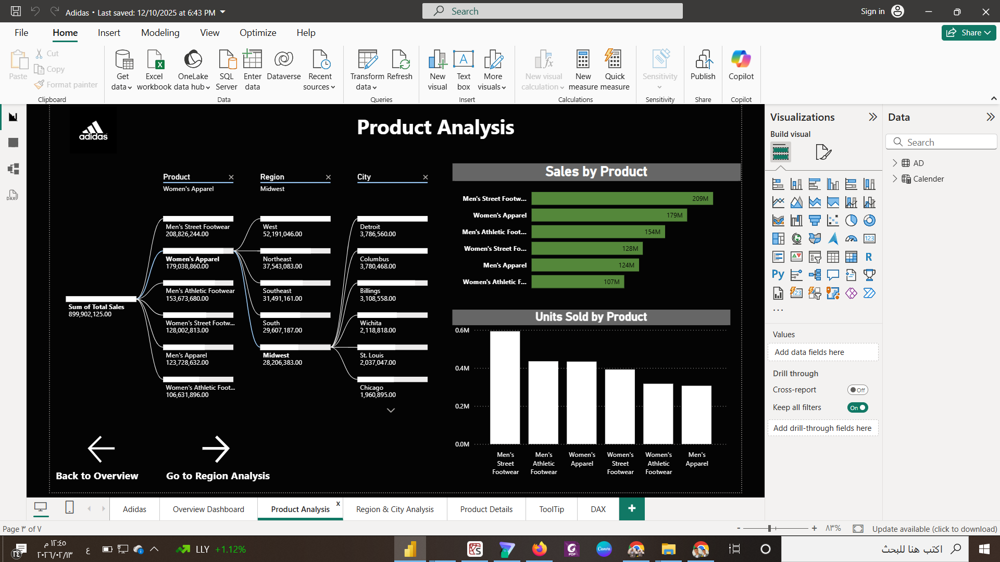

# Adidas US Sales Analysis Dashboard 

A comprehensive 3-page Power BI dashboard analyzing sales performance, regional distribution, and product profitability for Adidas across the United States.

##  Report Structure (3 Key Pages)

###  Sales & Profit Overview
* **Focus:** Tracking total sales, operating profit, and units sold over time to identify seasonal trends and overall growth.
* **Visual Preview:**

###  Regional Geography Analysis
* **Focus:** Deep dive into sales by State and City. It identifies the most profitable regions and geographic market share.
* **Visual Preview:**

###  Product & Category Performance
* **Focus:** Analyzing which product categories (Footwear, Apparel, Accessories) and specific items are driving the highest revenue.
* **Visual Preview:**

##  Technical Highlights
* **DAX Measures:** Created to calculate Year-over-Year (YoY) growth and profit margins.
* **Interactive Filters:** Implemented dynamic slicers for Date, Region, and Product Category.
* **Data Cleaning:** Used Power Query to handle the Adidas US Sales dataset and ensure data consistency.

##  Project Portfolio
* **Full Showcase:** [View on Behance](https://www.behance.net/essamlhem)
